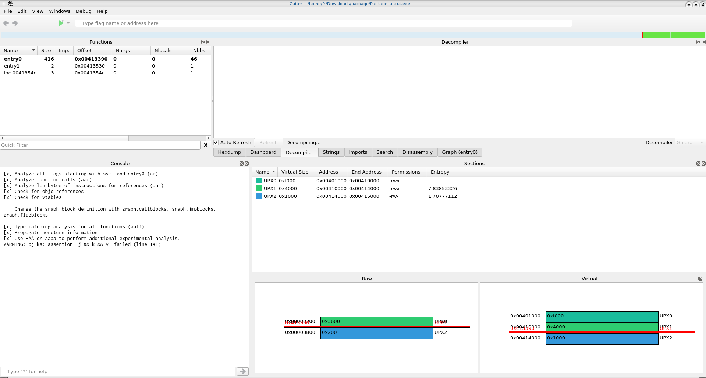

# Package

A package has arrived, come take it =D (enter the flag in KAF{} format).

## Overview
A windows binary with nothing interesting. Let's try to see what's inside with Cutter.

## Sections

Actually nothing in functions, which seems suspicious. Binary contains some 'UPX' sections, probably it is packed by upx. In linux it is possible to unpack this content just with 'upx -d', here we go.

## main
After unpacking symbols are showing us a lot of possible functions but first one need to look at main.
```c
undefined4 sym._main(void)
{
	uint32_t uVar1;
	int32_t iVar2;
	undefined4 uVar3;
	undefined auStack87 [21];
	undefined auStack66 [62];

	sym.___main();
	sym._puts("Hello, you have a package in the mail!");
	sym._puts("Please enter your details, inorder to take the package");
	sym._printf("Enter your name : ");
	sym._scanf(0x4050b6, auStack66);
	uVar1 = sym._strlen(auStack66);
	if (0x32 < uVar1) {
		sym._printf("You reached the max length!");
		sym._exit(0);
	}

	sym._printf("Enter your password: ");
	sym._scanf(0x4050b6, auStack87);
	iVar2 = sym._strlen(auStack87);
	auStack87[iVar2] = 0;
	uVar1 = sym._strlen(auStack87);
	if (0x32 < uVar1) {
		sym._printf("You reached the max length!");
		sym._exit(0);
	}

	uVar3 = sym._hashed((int32_t)"n9ain9ain9ai_n9aik9l");
	iVar2 = sym._strncmp(uVar3, auStack87, 0x14);

	if (iVar2 == 0) {
		sym._printf("Enjoy your package!");
		sym._exit(0);
	}

	sym._printf("THIS IS NOT YOUR PACKAGE!!!");
	return 0;
}
```

Very suspicious `hashed` function which is a key of our investigation, all other information seems are not relevant at all, `user` is not checked anywhere.

## hashed
```c
int32_t * __cdecl sym._hashed(int32_t arg_8h)
{
	char cVar1;
	int32_t var_20h;
	int32_t var_1ch;
	int32_t var_18h;
	int32_t var_14h;
	int32_t var_10h;
	int32_t var_ch;
	undefined4 var_8h;
	int32_t var_4h;

	var_4h = 0;
	while (var_4h < 0x14) {
		cVar1 = *(char *)(arg_8h + var_4h);
		if ((cVar1 < 'a') || ('z' < cVar1)) {
			if ((cVar1 < '0') || ('9' < cVar1)) {
				*(char *)((int32_t)&var_20h + var_4h) = cVar1;
			} else {
				*(char *)((int32_t)&var_20h + var_4h) = cVar1 + -5;
			}
		} else {
			*(char *)((int32_t)&var_20h + var_4h) = cVar1 + '\x02';
		}
		var_4h = var_4h + 1;
	}

	return &var_20h;
}
```

Let's code it in human-readable format.

```c
#include <stdio.h>
#include <unistd.h>
#include <stdint.h>
#include <string.h>

void hashed(int32_t *arg_8h)
{
	char ch;
	char j[0x15] = {};
	uint32_t i;

	i = 0;
	while (i < 0x14) {
		ch = *((char *)arg_8h + i);
		if ((ch < 'a') || ('z' < ch)) {
			if ((ch < '0') || ('9' < ch)) {
				j[i] = ch;
			} else {
				j[i] = ch + -5;
			}

		} else {
			j[i] = ch + '\x02';
		}
		i++;
	}
	printf("the password '%s'\n", j);
}

int main() {
	const char *p = "n9ain9ain9ai_n9aik9l";
	hashed((int32_t *)p);
}

```

After execution we see the sentence:
`the password 'p4ckp4ckp4ck_p4ckm4n'`

`KAF{p4ckp4ckp4ck_p4ckm4n}` the our flag, hooray!
